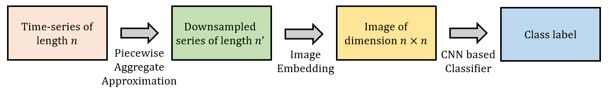
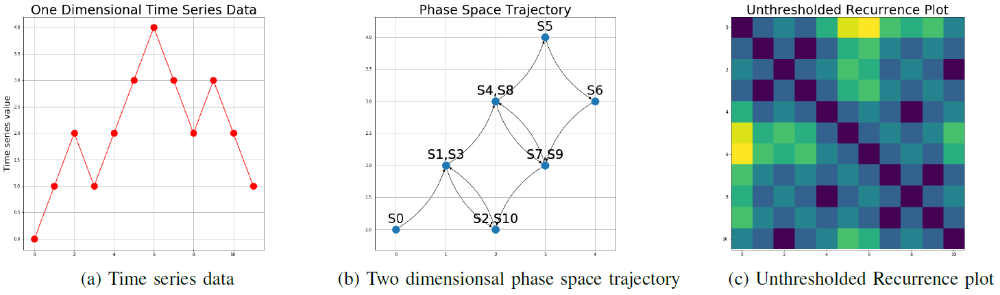

This repository was made to meet the final project requirements of course Advanced Machine Learning (CS5824), Fall 2019.

## Team members
Shuchismita Biswas, Sarthak Gupta, Sanij Gyawali, Sagar Karki

# Classification of Time-Series Images Using Deep Convolutional Neural Networks
A time-series refers to a sequence of data points, ordered temporally. Time-series analysis finds many real-world applications, in fields like weather forecasting, stock markets, biomedical signal monitoring, video processing and industrial instrumentation. This has motivated efforts and research into **time-series classification (TSC)** tasks that assign a label  to a time-series . Traditional TSC methods may be categorized into two broad classes- frequency-domain (spectral analysis, wavelet analysis etc) and time-domain (auto-correlation, auto-regression, cross-correlation etc) methods. More recently deep neural networks (DNN) have been applied to TSC tasks successfully. 

Recent advances in the field of computer vision have developed efficent DNNs, like **Convolutional Neural Networks (CNN)** for image classification. In recent literature, some papers have proposed image embedding of time series data so as to leverage image classification algorithms for the TSC task. In this project, we reproduce two image embedding methods for time series data- **Recurrence Plots (RP)** [1] and **Gramian Angular Summation Field (GASF)** [2] and use a CNN to classify the generated images. We test the classification algorithm (summarized in fig. 1) using two datasets from the UCR dataset archive [3] and verify the results reported in [1]. Downsampling of the original time-series is done to ease computational burden.

> Fig. 1: Pipeline of the time series classification (TSC) algorithm.

## Encoding Time-Series into Images
The idea of imaging time-series entails training machines to *visually* recognize, classify and learn temporal structures and patterns. Here, we describe two methods that this project has explored. 

### Recurrence Plots (RP)
Time series data are characterized by distinct behavior like periodicity, trends and cyclicities. Dynamic nonlinear systems exhibit recurrence of states which may be visualized through RPs. First introduced in [4], RPs explore the -dimensional phase space trajectory of a system by representing its recurrences in two dimensions. They capture how frequently a system returns to or deviates from its past states. Mathematically, this may be expressed as below.

Here,  and  represent the system states at time instants  and  respectively.  is the number of system states considered. In the original RP method, the  matrix is binary, i.e. its entries are  if the value of  is above a pre-determined threshold and 0 otherwise. We do away with the thresholding since unthresholded RPs capture more information. Images so obtained capture patterns which may not be immediately discernible to the naked eye. A detailed procedure for constructing a RP plot of a simple time series is shown in Fig. 2.

> Fig. 2: Procedure for constructing unthresholded RP images from time-series data, reproduced from [1]. On the left panel, we show a simple univariate time series  with 12 samples. The middle panel shows its two dimensional phase space trajectory with . The right panel shows the unthresholded RP for . It is a  matrix, whose -th entry is the euclidean distance between  and  in the phase space.

### Gramian Angular Summation Field (GASF)

## Convolutional Neural Networks
CNNs like regular DNNs consist of a input layer, hidden layers and an output layer. Training a CNN also has a similar purpose as a regular DNN - to minimize the loss function measured at the output layer. The main difference between the CNNs and DNNs lies in how this information flows through a CNN.

Unlike a regular DNN which use matrix dot products, the information between layers in a CNN can be a result of the convolution operation. This is specifically useful for images for which a convolution can be seen as a rolling matrix dot products over smaller portions of the image. Additionally, multiple such moving matrices can be stacked together to add a dimension of depth in addition to width and height.

> Fig 3: A regular DNN

> Fig 3: An example CNN

Additionally, CNNs include a Pool layer for downsampling the information and a fully-connected output layer to produce output values corresponding to each of the  classification classes.

## Experiments

<table class="tg">
  <tr>
    <th class="tg-c3ow">Dataset</th>
    <th class="tg-c3ow" colspan="2">Accuracy reported</th>
    <th class="tg-c3ow" colspan="2">Accuracy Obtained</th>
  </tr>
  <tr>
    <td class="tg-c3ow"></td>
    <td class="tg-c3ow">RP-CNN</td>
    <td class="tg-c3ow">GASF-CNN</td>
    <td class="tg-c3ow">RP-CNN</td>
    <td class="tg-c3ow">GASF-CNN</td>
  </tr>
  <tr>
    <td class="tg-c3ow">ECG 200</td>
    <td class="tg-c3ow"></td>
    <td class="tg-c3ow"></td>
    <td class="tg-c3ow"></td>
    <td class="tg-c3ow"></td>
  </tr>
  <tr>
    <td class="tg-c3ow">Fifty words</td>
    <td class="tg-c3ow"></td>
    <td class="tg-c3ow"></td>
    <td class="tg-c3ow"></td>
    <td class="tg-c3ow"></td>
  </tr>
</table>

## Summary
