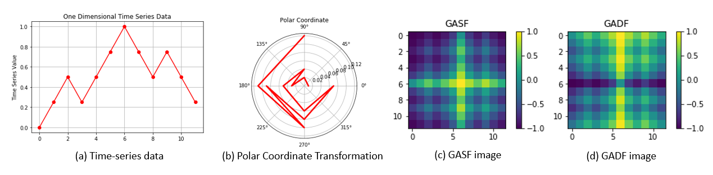
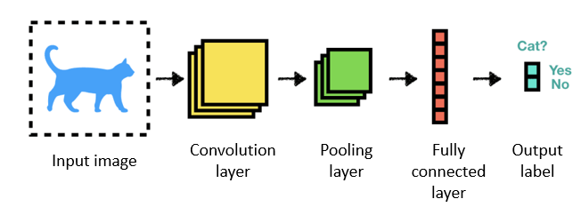

This repository was made to meet the final project requirements of course Advanced Machine Learning (CS5824), Fall 2019.

## Team members
Shuchismita Biswas, Sarthak Gupta, Sanij Gyawali, Sagar Karki

# Classification of Time-Series Images Using Deep Convolutional Neural Networks
A time-series refers to a sequence of data points, ordered temporally. Time-series analysis finds many real-world applications, in fields like weather forecasting, stock markets, biomedical signal monitoring, video processing and industrial instrumentation. This has motivated efforts and research into **time-series classification (TSC)** tasks that assign a label  to a time-series . Traditional TSC methods may be categorized into two broad classes- frequency-domain (spectral analysis, wavelet analysis etc) and time-domain (auto-correlation, auto-regression, cross-correlation etc) methods. More recently deep neural networks (DNN) have been applied to TSC tasks successfully. 

Recent advances in the field of computer vision have developed efficent DNNs, like **Convolutional Neural Networks (CNN)** for image classification. However, in feedforward neural networks, every observation is treated as independent and identically distributed (iid). Therefore these neural nets may no be directly applied to time series analysis as they fail to preserve the  temporal relationshipp present in sequential observations. In recent literature, some papers have proposed image embedding of time series data so as to leverage image classification algorithms for the TSC task. In this project, we reproduce two image embedding methods for time series data- **Recurrence Plots (RP)** [1] and **Gramian Angular Field (GAF)** [2] and use a CNN to classify the generated images. We test the classification algorithm (summarized in fig. 1) using two datasets from the UCR dataset archive [3] and verify the results reported in [1]. Downsampling of the original time-series is done to ease computational burden.

**Reference [1] claims that the RP image embedding method combined with a deep CNN-based classifier outperforms other benchmark TSC methods in literature as well as the GAF imaging method. This project checks whether the TSC accuracy reported by [1] can be reproduced.** 

> Fig. 1: Pipeline of the time series classification (TSC) algorithm.

## Encoding Time-Series into Images
The idea of imaging time-series entails training machines to *visually* recognize, classify and learn temporal structures and patterns. Here, we describe two methods that this project has explored. 

### Recurrence Plots (RP)
Time series data are characterized by distinct behavior like periodicity, trends and cyclicities. Dynamic nonlinear systems exhibit recurrence of states which may be visualized through RPs. First introduced in [4], RPs explore the -dimensional phase space trajectory of a system by representing its recurrences in two dimensions. They capture how frequently a system returns to or deviates from its past states. Mathematically, this may be expressed as below.

Here,  and  represent the system states at time instants  and  respectively.  is the number of system states considered. In the original RP method, the  matrix is binary, i.e. its entries are  if the value of  is above a pre-determined threshold and 0 otherwise. We do away with the thresholding since unthresholded RPs capture more information. Images so obtained capture patterns which may not be immediately discernible to the naked eye. A detailed procedure for constructing a RP plot of a simple time series is shown in Fig. 2.

> Fig. 2: Procedure for constructing unthresholded RP images from time-series data, reproduced from [1,5]. On the left panel, we show a simple univariate time series  with 12 samples. The middle panel shows its two dimensional phase space trajectory with . The right panel shows the unthresholded RP for . It is a  matrix, whose -th entry is the euclidean distance between  and  in the phase space.

~~~
def r_plot(data,delay=0):
    #input datatype data : ndarray, 1xn, n-number of samples in each series
    #input datatype delay : int, delay embedding for RP formation, default value is 1
    #output datatype rp : ndarray, nxn, unthresholded recurrence plot for series
    
    transformed = np.zeros([2,len(data)-delay])
    transformed[0,:] = data[0:len(data)-delay]
    transformed[1,:] = data[delay:len(data)]
    rp = np.zeros([len(data)-delay,len(data)-delay])
    for i in range(len(rp)):
        temp = np.tile(transformed[:,i],(len(rp),1)).T-transformed
        temp2 = np.square(temp)
        rp[i,:] = np.sum(temp2,axis=0)
    return np.array(rp)
~~~

### Gramian Angular Field (GAF)
In this image embedding technique, the time series is first transformed into the polar coordinates, where the radius represents the time stamps, and cosine of the angle represents the amplitude values in the data rescaled in the interval [-1,1] or [0,1]. Here we have used the range [0,1], and the arccos values in this range correspond to angular values in the range [0, π/2], which is later used in calculating information granularity in the GAF. Next, the cosine angle  is calculated using the time stamp, , as:

. 

Radius   is given by , where  is a constant used as regularization factor for the polar space span. As the time stamp increases, the polar coordinate mapping represents the change in relative calculated angle resulting in a different perspective of the time series behavior. This is illustrated in the fig. 5. GAF provides two major advantages-: (a) a one-to-one mapping of the time series to the polar coordinates, and (b) preservation of absolute temporal correlations. Once the time series data is mapped into the polar coordinate system, the Gramian matrix can be contstructed. 

*Gramian Angular Summation Field (GASF)* is formed using the trigonometric summation of the angle given by inverse cosine in the rescaled time series signal as follows:

Using the trigonometric difference of the angles instead of summation would result in the formation of the *Gramian Angular Difference Field (GADF)*.

~~~
def polar_rep (data):
    #input datatype data : ndarray, 1xn, n-number of samples in each series
    #output datatype phi : ndarray, 1xn 
    #output datatype r : ndarray, 1xn
    
    phi=np.arccos(data)
    r=(np.arange(0,np.shape(data)[1])/np.shape(data)[1])+0.1
    return phi,r
    
def GADF(data):
    #input datatype data : ndarray, 1xn, n-number of samples in each series
    #output datatype gadf : ndarray, nxn, GADF for series
    
    datacos = np.array(data)
    datasin = np.sqrt(1-datacos**2)
    gadf = datasin.T*datacos-datacos.T*datasin
    return gadf
 ~~~

>Fig. 3: Construction of GAF images using the procedure in [2]. The first panel shows the original time series, the second panel shows its tranjectory the polar coordinates. Trajectory radius decreases with time, thereby preserving the temporal relationship present in the original data. The third and fourth panels show the corresponding summation and difference field images respectively.

## Convolutional Neural Networks
CNNs like regular DNNs consist of a input layer, hidden layers and an output layer, but at least one of the hidden layers must be *convolutional*. Training a CNN also has a similar purpose as a regular DNN - to minimize the loss function measured at the output layer. The main difference between the CNNs and DNNs lies in how this information flows through a CNN. [6]

 
Fig 3: A fully connected DNN with two hidden layers 

Unlike a regular DNN which use matrix dot products, the information between layers in a CNN can be a result of the convolution operation. This is specifically useful for images for which a convolution can be seen as a rolling matrix dot products over smaller portions of the image. Additionally, multiple such moving matrices can be stacked together to add a dimension of depth in addition to width and height.

The working principle of CNNs is biologically inspired by the organization of the visual cortex of mammals. In a mammal’s eye, individual neurons respond to visual stimuli only in the receptive field, which is a restricted region. The receptive fields of different regions partially overlap in a manner that covers the entire field of vision. Similarly, in a convolutional layer of the CNN, neurons only receive input from a subarea of the previous layer, but the subareas from which different neurons receive information are overlapping. Pooling layers combine the outputs of clusters of neurons into a single neuron in the next layer. In a fully connected layer (similar to a multi-layer perceptron) , each neuron receives input from every element of the previous layer. In this manner, CNNs automatically extract features from images and show excellent performance in computer vision tasks. A detailed description of CNNs is available [here](https://www.deeplearningbook.org/contents/convnets.html).

 
Fig 4: An example CNN classifier

## Experiments

### Dataset 
In this project, the efficacy of using deep CNNs in classifying time series images is demonstrated on two datasets from the [UCR time series archive](https://www.cs.ucr.edu/~eamonn/time_series_data_2018/): **ECG200** and **FiftyWords**. 

 - *ECG200*: In this dataset, each series traces the electrical activity recorded during one heartbeat. The two classes are a normal heartbeat and a Myocardial Infarction.
 - *FiftyWords*: This dataset consists of word outlines taken from the George Washington library. Each case is a word. A series is formed by taking the height profile of the word.
 
<table class="tg">
  <tr>
    <th class="tg-7btt">Dataset</th>
    <th class="tg-7btt">No. of classes</th>
    <th class="tg-7btt">Length</th>
    <th class="tg-7btt">No. of training data </th>
    <th class="tg-7btt">No. of test data</th>
  </tr>
  <tr>
    <td class="tg-7btt">ECG200</td>
    <td class="tg-c3ow">2</td>
    <td class="tg-c3ow">96</td>
    <td class="tg-c3ow">100</td>
    <td class="tg-c3ow">100</td>
  </tr>
  <tr>
    <td class="tg-7btt">FiftyWords</td>
    <td class="tg-c3ow">50</td>
    <td class="tg-c3ow">270</td>
    <td class="tg-c3ow">450</td>
    <td class="tg-c3ow">455</td>
  </tr>
</table>

 
 

 
> FIg. 6: Illustrating the ECG200 dataset

### Piecewise Approximate Aggregation (PAA)

PAA was used to downsample the original time-series so that the computational burden on CNN classifier could be reduced. It simply means representing a *piece* of the time-series by its arithmetic mean. In [1], the authors mention that they choose from 28 X 28, 56 X 56 and 64 X 64 pixel inputs to represent time-series data as per their lengths. We used PAA to obtain these image sizes. Our experimental hyperparameters are detailed in a later section.

~~~
def rescale(data):
    #input datatype data: ndarray , dxn, d-number of series, n-number of samples in each series
    #output datatype rescaled: ndarray, dxn
    
    num=data-np.tile(np.mat(data.min(axis=1)).T,(1,np.shape(data)[1]))
    denom=np.tile(np.mat(data.max(axis=1)).T,(1,np.shape(data)[1]))-np.tile(np.mat(data.min(axis=1)).T,(1,np.shape(data)[1]))
    rescaled=np.multiply(num,1/denom)
    return rescaled
~~~

### CNN Structure

In this project, a deep CNN classifier following the structure in [1] was trained and evaluated. All experiments were carried out using [Keras](https://keras.io/examples/mnist_cnn/) on Google Colaboratory using the GPU hardware acceleration option. The CNN structure is summarized below. 

-  **Architecture** : Two-stage CNN 32(5)-2-32(5)-2-128-c. This means that there are two convolution layers with filter size 32 and kernel size 5 X 5. The convolutional layer is follwed by a 2 X 2 maxPooling layer and a 0.25 Dropout layer. The fully connected layer contains 128 hidden neurons followed by a 0.5 dropout layer. 'c' here, refers to the number of classes. 
- **Activation** : ReLU
- **Loss Function** : Categorical cross-entropy
- **Optimizer** : Adam

~~~
model = Sequential()
model.add(Conv2D(32, kernel_size=(5,5),
                 activation='relu',
                 input_shape=input_shape))
model.add(MaxPooling2D(pool_size=(2, 2)))
model.add(Dropout(0.25))
model.add(Conv2D(32, kernel_size=(5,5), 
                 activation='relu'))
model.add(MaxPooling2D(pool_size=(2, 2)))
model.add(Dropout(0.25))
model.add(Flatten())
model.add(Dense(128, activation='relu'))
model.add(Dropout(0.5))
model.add(Dense(num_classes, activation='softmax'))

model.compile(loss=keras.losses.categorical_crossentropy,
              optimizer=keras.optimizers.Adam(),
              metrics=['accuracy'])
              
model.fit(x_train, y_train,
          batch_size=batch_size,
          epochs=epochs,
          verbose=1,
          validation_data=(x_test, y_test))
~~~

### Hyperparameters

The following hyperparameters were used for the CNN classifier on each dataset. 

> Table I: Hyperparameters for the RP-CNN method 

| **Dataset** | **Image size** | **Batch size** | **Epochs** |
| :-------: | :-------: | :-------: | :-------: |
| ECG200 | 32 x 32|10|150|
| FiftyWords | 30 X 30 | 10 | 500 |

> Table II: Hyperparameters for the GADF-CNN method  

| **Dataset** | **Image size** | **Batch size** | **Epochs** |
| :-------: | :-------: | :-------: | :-------:|
| ECG200 |32 X 32|10 |500|
| FiftyWords | 30 X 30 | 10|500|

### Performance Accuracy

This project was able to closely reproduce the results in table 1 of reference [1], pertaining to the performance of image-embedding aided deep CNN based classifiers for the TSC task. Hyperparameters used for specific datasets have not been explicitly mentioned in the paper. Hence, we used a trial and error approach to arrive at the hyperparameters mentioned in the previous section.

<table class="tg">
  <tr>
    <th class="tg-c3ow">Dataset</th>
    <th class="tg-c3ow" colspan="2">Accuracy reported</th>
    <th class="tg-c3ow" colspan="2">Accuracy Obtained</th>
  </tr>
  <tr>
    <td class="tg-c3ow"></td>
    <td class="tg-c3ow">RP-CNN</td>
    <td class="tg-c3ow">GADF-CNN</td>
    <td class="tg-c3ow">RP-CNN</td>
    <td class="tg-c3ow">GADF-CNN</td>
  </tr>
  <tr>
    <td class="tg-c3ow">ECG 200</td>
    <td class="tg-c3ow">1.0</td>
    <td class="tg-c3ow">0.91</td>
    <td class="tg-c3ow">0.94</td>
    <td class="tg-c3ow">0.88</td>
  </tr>
  <tr>
    <td class="tg-c3ow">FiftyWords</td>
    <td class="tg-c3ow">0.74</td>
    <td class="tg-c3ow">0.7</td>
    <td class="tg-c3ow">0.73</td>
    <td class="tg-c3ow">0.7</td>
  </tr>
</table>

## Summary

- **Results from the original paper:** In [1], the authors propose that the superior performance of CNNs in image classification maybe laveraged for time series classification as well. They first convert a time series into images using the unthresholded recurrence plot method [4] and then train a CNN to learn patterns and structures in these images. The paper illustrates through experiments on datasets from the UCR archive [3] that the RP-CNN method outperforms other conventional TSC methods as well as image embedding methods [2] proposed in literature.
- **Procedure followed to reproduce results:** We reproduced the RP-aided TSC from [1] and compared it to the GADF embedding method proposed in [2]. The results obtained were compared to the ones reported in table 1 in the original paper [1]. Time series data is first downsampled using piecewise aggregate approximation, embedded into images and then classified using a CNN. Our results show that we are closely (although not exactly) able to reproduce what has been presented in [1]. All experiments were performed on Google Collaboratory using Keras and the GPU hardware acceleration option. The hyperparameters and CNN architecture used are elaborated in this report, and codes are available at this repository. The CNN classifier has been trained following this [Keras example](https://keras.io/examples/mnist_cnn/).
- **Analysis and Discussion:** In feedforward neural networks, every data point is treated independently, therefore with conventional DNNs, the temporal relationship in time-series cannot be preserved. Recurrent Neural Networks (RNNs) and Long Short Term Memory networks (LSTMs) have been used to overcome these limitations, but face their own drawbacks, like vanishing gradient problems and huge resource requirement for fast training. CNNs, in recent years, have been very successful in image and pattern recognition related tasks and are able to detect the presence of objects of different sizes and orientations in varying positions in an image. This motivates exploring encoding time series as images so that temporal relationships can be embedded as spatial relationship that is present in images. [1] proposes doing this via RPs which provides a means of visually encoding periodic trends characteristic of stochastic processes or dynamic non-linear systems from which most time-series observations are generated. Once the time-series data has been converted to equivalent images, these images can be analyzed using existing deep learning techniques developed for computer vision related tasks. 
- **Corroboration:** The experiments performed in this project corroborate the findings of [1], specifically the error rates/accuracy reported w.r.t. the ECG200 and FiftyWord datasets. In both cases, we were able to obtain accuracy very close to what has been reported. Moreover, in both cases the RP-CNN method outperformed the GADF-CNN method. 

## References
[1]  N. Hatami, Y. Gavet, and J. Debayle, “Classification of Time-Series
Images Using Deep Convolutional Neural Networks,” *ArXiv*, vol.
abs/1710.00886, 2017.

[2]  Z. Wang and T. Oates, “Imaging Time-series to Improve Classification
and Imputation,” in *Proceedings of the 24th International Conference
on Artificial Intelligence*, 2015, pp. 3939–3945.

[3] Y. Chen, E. Keogh, B. Hu, N. Begum, A. Bagnall, A. Mueen and G. Batista, "The UCR time series archive," *ArXiv*, vol. abs/1810.07758v2, 2019.

[4] N. Marwan, M. C. Romano, M. Thiel, and J. Kurths, “Recurrence Plots
for the Analysis of Complex Systems,” *Physics Reports*, vol. 438, no. 5,
pp. 237–329, Jan 2007.

[5] S. Biswas, R.  Meyur and V. Centeno, "DeVLearn: A Deep Visual Learning Framework for
Localizing Temporary Faults in Power Systems", *ArXiv*, vol. abs/1911.03759v1, 2019.

[6]  I. Goodfellow,  Y. Bengio,  and A. Courville, Deep  Learning.MIT Press,  2016,  [http://www.deeplearningbook.org](http://www.deeplearningbook.org).

